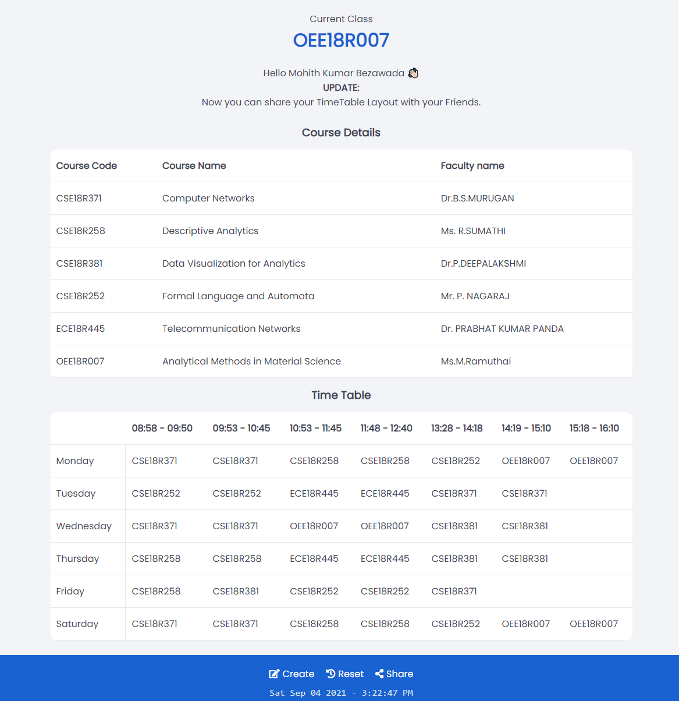

# CSE-B-Class-Join

## Contents
|Name|Navigate|
|:-|:-:|
|Page|[↗️](https://myselfmohith.github.io/CSE-B-Class-Join/ "CTRL + Click to open in new tab") |
|Preview|[▼](#preview)|
|Folder Description|[▼](#folder-description)|
|Build Utils|[▼](#build-utils)|

### Javascript Techologgies
* Notification API

### Preview
</img>

### Folder Description
|Name|Descriptions|
|:-|:-|
|`extras`|Files that are not required for the website.|
|`icons`|Contains the **PWA** Icons and favicon|
|`Scripts`|As the name suggests it contains the **Javascript** files for the website|

### Build Utils
|Item|Source|
|:-|:-|
|Font|`poppins` - from google fonts|
|SVG|`fontawsome`|
|Color|Total color schme is inspired from **brave** and **klu quiz** accent color|
